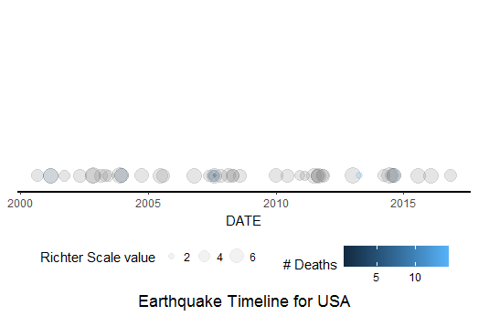
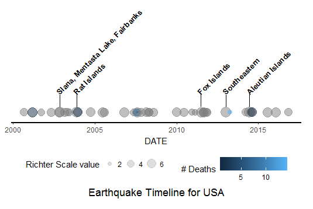
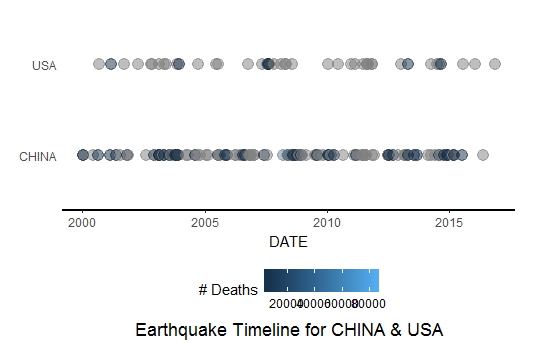
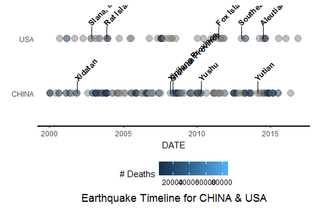
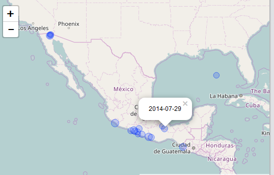
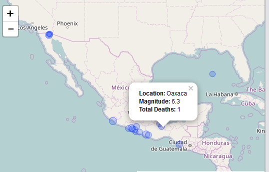

<!-- README.md is generated from README.Rmd. Please edit that file -->
Aim of the Package
------------------

The NOAA Significant Earthquake Database<sup>1</sup> contains data on destructive earthquakes from 2150 B.C. to the present. The database is available [here](https://www.ngdc.noaa.gov/nndc/struts/form?t=101650&s=1&d=1). This package provides functions to analyze and visualize the NOAA earthquake data. Two visualizations can be generated – a timeline for earthquakes and a map of earthquake epicenters.

Accessing the Package
---------------------

This package is available on GitHub and can be installed using the devtools package:

``` r
library(devtools)
install_github("leigit/earthquakesViz")
library(earthquakesViz)
```

Example - Read and Clean Data
-----------------------------

The NOAA Significant Earthquakes current data file can be downloaded or a data file in txt.gz format is provided with the package. The eq\_clean\_data() function generates a DATE column, converts the data in several columns to numeric data, and calls the eq\_location\_clean function to convert the data in the LOCATION\_NAME to a format suitable for display. Note that only earthquake data in AD years is available after the cleaning step. To read and clean the data:

``` r
#set the location of the file
filename<-system.file("extdata","earthquakes_data.txt.gz",package="earthquakesViz")
#read the data only
eq_data <- eq_data_read(filename)
#read the data and clean the data - 2 ways
eq_clean <- clean_data<-eq_data_read(filename) %>% eq_clean_data()
eq_clean <- readr::read_delim(filename, delim = "\t") %>% eq_clean_data()
```

Example - Timeline Visualization
--------------------------------

After the Read and Clean Data step, the NOAA earthquake data can be displayed in a timeline visualization. Two geoms that are used in conjunction with ggplot are available. The first geom is called geom\_timeline and displays a timeline of earthquakes and the second geom is called geom\_timeline\_map and displays a timeline label for the earthquakes with the largest magnitudes. The number of earthquakes to label can be provided to the function or the default of 5 will be used.

It is best to subset the data so that the visualization will provide meaningful information. One country or several countries can be displayed for a particular time period.

To display a timeline of earthquakes in the USA after 2000:

``` r
#set the location of the file
filename<-system.file("extdata","earthquakes_data.txt.gz",package="earthquakesViz")
#generate timeline for USA earthquakes after 2000
readr::read_delim(filename, delim = "\t") %>%
eq_clean_data() %>%
dplyr::filter(COUNTRY == "USA" & lubridate::year(DATE) >= 2000) %>%
eq_time(size="EQ_PRIMARY",color="DEATHS")
```

The timeline looks like this:



To display a timeline of earthquakes in the USA after 2000 with location labels for the 5 earthquakes with the largest magnitudes:

``` r
filename<-system.file("extdata","earthquakes_data.txt.gz",package="earthquakesViz")
readr::read_delim(filename, delim = "\t") %>%
eq_clean_data() %>%
dplyr::filter(COUNTRY == "USA" & lubridate::year(DATE) >= 2000) %>%
eq_time(size="EQ_PRIMARY",color="DEATHS",alpha=0.5,timeline_label=TRUE)
```

The labeled timeline looks like this:



To display a timeline of earthquakes in the USA and China after 2000:

``` r
filename<-system.file("extdata","earthquakes_data.txt.gz",package="earthquakesViz")
readr::read_delim(filename, delim = "\t") %>%
eq_clean_data() %>%
dplyr::filter((COUNTRY=="USA" | COUNTRY=="CHINA") & lubridate::year(DATE) >= 2000) %>%
eq_time(y="COUNTRY",color="DEATHS",alpha=0.5)
```

The timeline looks like this:



To display a timeline of earthquakes in the USA and China after 2000 with location labels for the 5 earthquakes with the largest magnitudes:

``` r
filename<-system.file("extdata","earthquakes_data.txt.gz",package="earthquakesViz")
readr::read_delim(filename, delim = "\t") %>%
eq_clean_data() %>%
dplyr::filter((COUNTRY=="USA" | COUNTRY=="CHINA") & lubridate::year(DATE) >= 2000) %>%
eq_time(y="COUNTRY",color="DEATHS",alpha=0.5,timeline_label=TRUE)
```

The labeled timeline looks like this:



Example - Interactive Map Visualization
---------------------------------------

After the Read and Clean Data step, the NOAA earthquake data can be displayed in an interactive map visualization. The earthquake data is mapped using the latitude and longitude of the earthquake epicenter. The leaflet<sup>2</sup> package is used to create an interactive map. Clicking on an epicenter circle will open a popup with information about the earthquake. The information in the popup can be customized in two ways. First, a data column name like DATE can be specified. Second, the value of "popup\_text" can be specified which will automatically generate popup text with the values for Location, Magnitude, and Deaths.

It is best to subset the data so that the visualization will provide meaningful information. One country or several countries can be displayed for a particular time period.

To display a map of earthquakes in Mexico after 2000 with popup text set as DATE:

``` r
filename<-system.file("extdata","earthquakes_data.txt.gz",package="earthquakesViz")
readr::read_delim(filename, delim = "\t") %>%
eq_clean_data() %>%
dplyr::filter(COUNTRY == "MEXICO" & lubridate::year(DATE) >= 2000) %>%
eq_map(annot_col = "DATE")
```

The map looks like this:



To display a map of earthquakes in Mexico after 2000 with automated popup\_text:

``` r
filename<-system.file("extdata","earthquakes_data.txt.gz",package="earthquakesViz")
readr::read_delim(filename, delim = "\t") %>%
eq_clean_data() %>%
dplyr::filter(COUNTRY == "MEXICO" & lubridate::year(DATE) >= 2000) %>%
dplyr::mutate(popup_text = eq_create_label(.)) %>%
eq_map(annot_col = "popup_text")
```

The map looks like this:



Additional Functions
--------------------

There are also functions in the package which are called by the functions in the previous examples. These functions can be run separately.

``` r
#eq_location_clean() - to clean just the LOCATION_NAME column in the dataset
filename<-system.file("extdata","earthquakes_data.txt.gz",package="earthquakesViz")
eq_loc_clean <- readr::read_delim(filename, delim = "\t") %>%
eq_location_clean()

#eq_create_label() - to create the popup text for the leaflet map
filename<-system.file("extdata","earthquakes_data.txt.gz",package="earthquakesViz")
data_with_popup<-readr::read_delim(filename, delim = "\t") %>%
eq_clean_data() %>%
dplyr::filter(COUNTRY == "MEXICO" & lubridate::year(DATE) >= 2000) %>%
dplyr::mutate(popup_text = eq_create_label(.))

#geom_timeline() - to create the timeline
#example for 1 country
filename<-system.file("extdata","earthquakes_data.txt.gz",package="earthquakesViz")
readr::read_delim(filename, delim = "\t") %>%
eq_clean_data() %>%
dplyr::filter(COUNTRY == "USA" & lubridate::year(DATE) >= 2000) %>%
ggplot() +
geom_timeline(aes(x=DATE,size=EQ_PRIMARY,color=DEATHS),alpha=0.5)

#example for more than 1 country
filename<-system.file("extdata","earthquakes_data.txt.gz",package="earthquakesViz")
readr::read_delim(filename, delim = "\t") %>%
eq_clean_data() %>%
dplyr::filter((COUNTRY=="USA" | COUNTRY=="CHINA") & lubridate::year(DATE) >= 2000) %>%
ggplot() +
geom_timeline(aes(x=DATE,y=COUNTRY,size=EQ_PRIMARY,color=DEATHS),alpha=0.5)  

#geom_timeline_label() - to create the labels for the timeline
#examples for 1 country
filename<-system.file("extdata","earthquakes_data.txt.gz",package="earthquakesViz")
sample_USA <- readr::read_delim(filename, delim = "\t") %>%
eq_clean_data() %>%
dplyr::filter(COUNTRY == "USA" & lubridate::year(DATE) >= 2000)

ggplot(data = sample_USA, aes(x=DATE)) + geom_timeline() +
geom_timeline_label(data=sample_USA,aes(label=LOCATION_NAME),n_max=5) + theme_classic()

ggplot() +
geom_timeline_label(data=sample_USA,aes(x=DATE,label=LOCATION_NAME))

#example for more than 1 country
filename<-system.file("extdata","earthquakes_data.txt.gz",package="earthquakesViz")
sample_2_countries<- readr::read_delim(filename, delim = "\t") %>%
eq_clean_data() %>%
dplyr::filter((COUNTRY=="USA" | COUNTRY=="CHINA") & lubridate::year(DATE) >= 2000)

ggplot() +
geom_timeline_label(data=sample_2_countries,aes(x=DATE,y=COUNTRY,label=LOCATION_NAME))
```

References
----------

1.  National Geophysical Data Center / World Data Service (NGDC/WDS): Significant Earthquake Database. National Geophysical Data Center, NOAA. <doi:10.7289/V5TD9V7K>

2.  Leaflet: [rstudio.github.io/leaflet](rstudio.github.io/leaflet)
